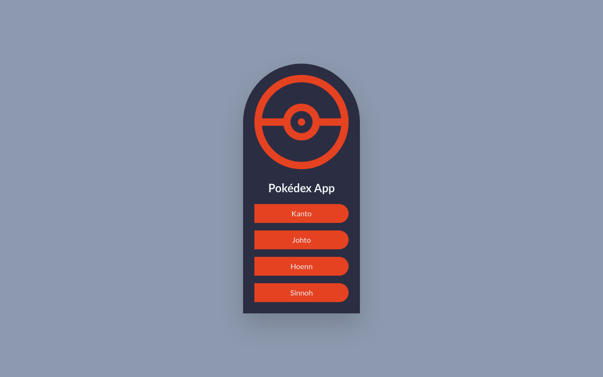

## 📄 Intro.

<div align="center">
Pokédex App in Next.js, Tailwind CSS and PokéAPI REST. <br><br>
</div>

[](https://pokedex-app-rouge.vercel.app/)

## 💼 Used technologies


## 🚨 Forking this repo

You can fork this repo and please give me proper credit, enjoy :).

## 🛠 Installation & Set Up

1. Install dependencies

   ```sh
   npm install
   ```

2. Start the development server

   ```sh
   npm run dev
   ```

## 🚀 Building and Running for Production

1. Generate a production build

   ```sh
   next build
   ```
